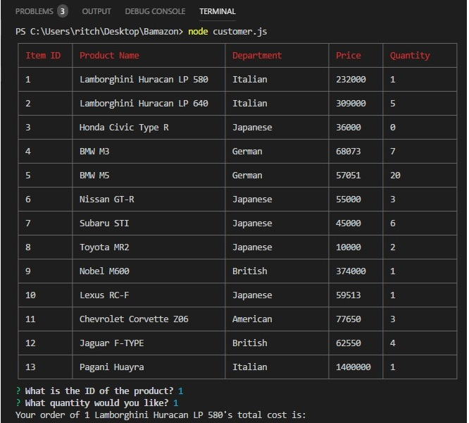

# Bamazon

Bamazon is a database application allowing user to view, select, and purchase from a list of products. This project utilizes NodeJS and MySQL to complete the opereation. Project assigned by The Coding Bootcamp offered at UCSD Extensions. 



## Getting Started

These instructions will get you a copy of the project up and running on your local machine for development and testing purposes. See deployment for notes on how to deploy the project on a live system.

### Prerequisites

What things you need to install the software and how to install them

```
MySQl, NodeJS, and github files
```
Github files: 
```
https://github.com/rduon002/Bamazon.git
```
### Installing

Downloaded from: https://dev.mysql.com/downloads/installer/

*Suggest using an older version due to possible terminal issues with latest version

Downloaded from: https://nodejs.org/en/download/

## Running the application
Open MySQL Workbench and connect to database.
CD into Bamazon folder in terminal.
Run application by:
```
node customer.js
```
### Using the Bamazon

Select a product by entering the ID value.
The Bamazon will query the products list and prompt
```
What quantity would you like?
```
Continue by answering the quantity of the order.

If the amount can be satisfied, Bamazon will respond by displaying the product name and total cost. Then update the table.
If the product's quantity is 0, and the user attempts to order, Bamazon will prompt: 
```
We apologize. This product is no longer available.0 left
```

### Code Overview

Setting global dependencies

```
let mysql = require("mysql");
let inquirer = require("inquirer");
let Table = require('cli-table');
```
Write the information required to connect to database
```
let connection = mysql.createConnection({
    host: "localhost",

    //Port
    port: 3306,

    //Username
    user: "root",

    //Password
    password: "diablo2",
    database: "bamazonDB"
});
```
Create database using MySQL
```
DROP DATABASE IF EXISTS bamazonDB;
CREATE database bamazonDB;

USE bamazonDB;

CREATE TABLE products (
  item_id INT AUTO_INCREMENT NOT NULL,
  product_name VARCHAR(100) NOT NULL,
  department_name VARCHAR(100) NOT NULL,
  price INT,
  stock_quantity INT,
  
  PRIMARY KEY(item_id)
);
```
Enter values for Bamazon to inventory
```
INSERT INTO products (product_name, department_name, price, stock_quantity)
VALUES 
  ("Lamborghini Huracan LP 580", "Italian", 232000, 3), 
  ("Lamborghini Huracan LP 640", "Italian", 309000, 5),
```
Connect to the database
```
connection.connect(function (err) {
    if (err) throw err;
    displayProducts();
});
```
Queries return data set and filtered by results. Allows for Bamazon to read through the products list from id name to price. 
```
function displayProducts(answer) {
    let query = "SELECT item_id, product_name, department_name, price, stock_quantity FROM products";
    connection.query(query, function (err, res) {
    for (let i = 0; i < res.length; i++) {
            displayTable.push(
                [res[i].item_id, res[i].product_name, res[i].department_name, res[i].price, res[i].stock_quantity]
```
,as well as, after user input and update.
```
connection.query(
      "UPDATE products SET ? WHERE ?", [{
          stock_quantity: quantityLeft,
},
{
  item_id: answer.item
}
```    
                   
The parseInt function converts its first argument to a string, parses it, and returns an integer. 
Check the value of product instock with user purchase order
```
if (parseInt(answer.count) > res[0].stock_quantity)
```
Figure out the total cost of the order by multiplying user input with price of one unit.
```
console.log("$ " + parseInt(res[0].price) * parseInt(answer.count));
```
## Deployment

Add additional notes about how to deploy this on a live system

## Built With

* [VisualStudio](https://visualstudio.microsoft.com/)
* [Cli-table](https://www.npmjs.com/package/cli-table) - Dependency

## Acknowledgments
Coding Bootcamp Team and Professionals
From the ground, up!


